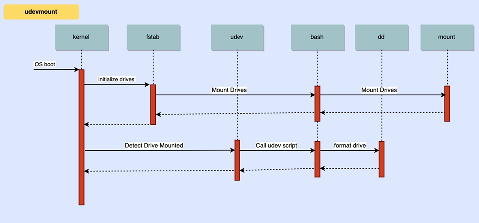

### 2.1 – Detailed list of Linux modules that will be modified/affected
- `udev` (used for detecting newly inserted devices/drives)
- `mount` (used to mount devices that have been detected)
- `dd` (used for creating empty drives or formatting new ones)

### 2.2 – Detailed list of any new modules that you will produce [or 'Not Applicable' if there are none]
Not Applicable, unless new bash script that `udev` will trigger counts

### 2.3 – Class diagram showing affected modules [and any new modules] and how they related to one another

### 2.4 – List or table of explanations of all command line options that will be implemented
N/A
