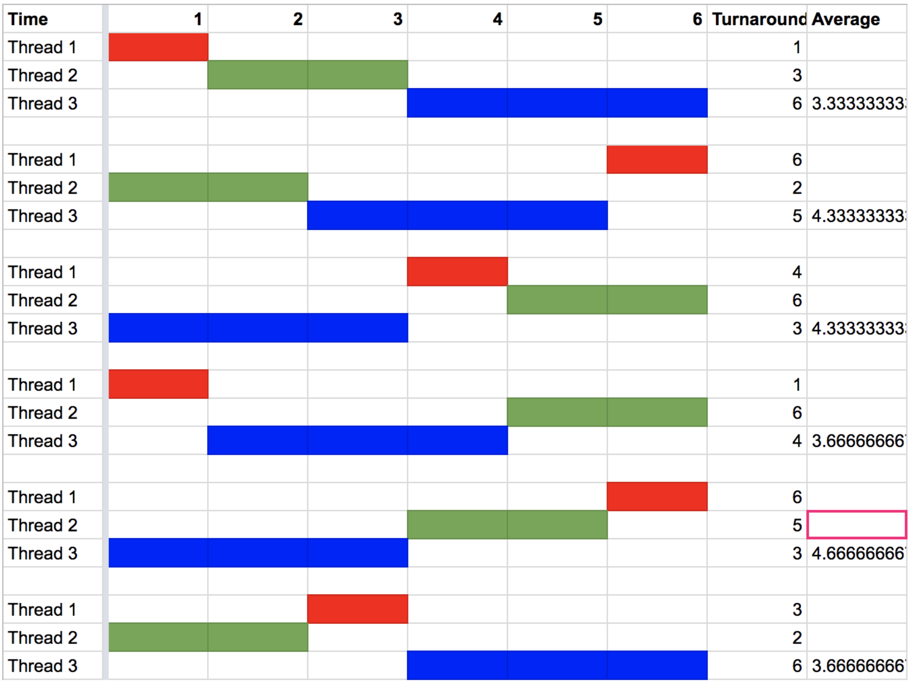

### 1) What is the difference between an operating system and middleware?
An operating system provides the services in its API by making use of the features supported by the hardware, while middleware provides the services in its API by making use of the features supported by an underlying operating system.

### 2) What is the relationship between threads and processes?
A process can have many threads running under it, while a thread requires some process  spawn it

### 3) Of all the topics previewed in chapter one of the text book, which one are you most looking forward to learning more about? Why?
Anthony: Multithreading, the Kernel; these topics are important to what I want to go into
Tyler: Security. Understanding how to identify the vulnerabilities and risk in certain systems is very important and interesting.
Teddy: Networking; I’m interested in how an operating systems handles network calls and interacts with the web.

### 4) Suppose thread A goes through a loop 100 times, each time performing one disk I/O operation, taking 10 milliseconds, and then some computation, taking 1 millisecond. While each 10-millisecond disk operation is in progress, thread A cannot make any use of the processor. Thread B runs for 1 second, purely in the processor, with no I/O. One millisecond of processor time is spent each time the processor switches threads; other than this switching cost, there is no problem with the processor working on thread B during one of thread A's I/O operations. (The processor and disk drive do not contend for memory access bandwidth, for example.)
#### a) Suppose the processor and disk work purely on thread A until its completion, and then the processor switches to thread B and runs all of that thread. What will the total elapsed time be?
Process A = (10 + 1) * 100 = 1100ms
Process B = 1000ms
Switch Time = 1ms
A + Switch Time + B = 2101ms

#### b) Suppose the processor starts out working on thread A, but every time thread A performs a disk operation, the processor switches to B during the operation and then back to A upon the disk operation's completion. What will the total elapsed time be?
A Disk & B Processor = 10ms
Switch Time = 1ms
A Processor = 1ms
A&B + Switch + A Processor + Switch = (10 + 1 + 1 + 1) * 100 = 1300ms

#### c) In your opinion, which do you think is more efficient, and why?
Option B is faster than Option A, by 800ms, however it may require additional space on the stack to store the current information about Process A/B as they switch. Overall however, B seems to be more efficient.

### 5) Find and read the documentation for pthread_cancel(). Then, using your C programming environment, use the information and the model provided in Figure 2.4 on page 26 of the text book to write a program in which the initial (main) thread creates a second thread. The main thread should read input from the keyboard, waiting until the user presses the Enter key. At that point, it should kill off the second thread and print out a message reporting that it has done so. Meanwhile, the second thread should be in an infinite loop, each time around sleeping five seconds and then printing out a message. Try running your program. Can the sleeping thread print its periodic messages while the main thread is waiting for keyboard input? Can the main thread read input, kill the sleeping thread, and print a message while the sleeping thread is in the early part of one of its five-second sleeps?

### 6) Suppose a system has three threads (T1, T2, and T3) that are all available to run at time 0 and need one, two, and three seconds of processing, respectively. Suppose each thread is run to completion before starting another. Draw six different Gantt charts, one for each possible order the threads can be run in. or each chart, compute the turnaround time of each thread; that is, the time elapsed from when it was ready (time 0) until it is complete. Also, compute the average turnaround time for each order. Which order has the shortest average turnaround time? What is the name of the scheduling policy that produces this order?

Ordering the processes in: T1, T2, T3 has the shortest average turnaround time of 3.33 seconds.I

### 7) Google the C standard library API and find out how to get information from the command line by using a printf() call to display a prompt, then another call [which you will look up] to get the user input. Write a program in C to prompt the user demographic information including name, age, class year, and any three other data times you wish. Structure the program as a call-and-response program such that each data item is a single question with a single answer. When all data has been obtained, display the data on the console. Each data item must be on a separate line, and it must be appropriately labeled. The output must be done using a single printf() statement.
